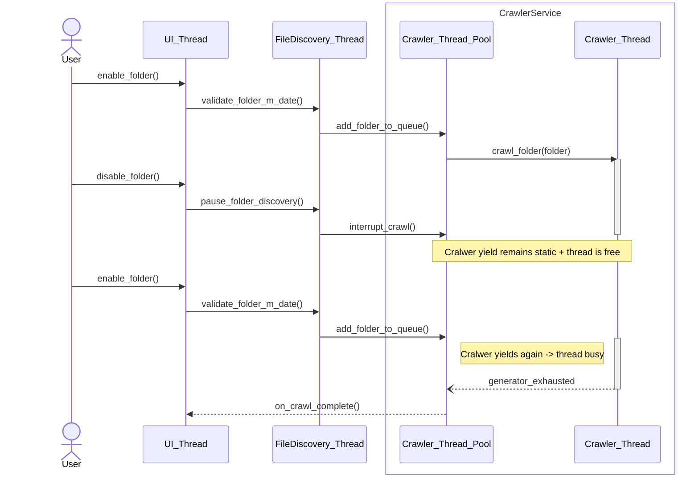

# 🧠 Iteradraw DEVLOG

*(This file is your ongoing mental anchor — one entry per session, top-most = most recent.
Keep each entry short but complete: what, why, and next.)*

## 💬 Tip for Future You
When you return after a break, do this:
1. Read this section (topmost entry).  
2. Open the last modified module — check the commit message or devlog entry date.  
3. Write a **“Warm-up Plan”** before you code: 3–5 bullets of what you’ll accomplish that day.

## [2025-11-25] — Rendering vertical slice
###  Integrating render pipeline using the Qt framework
I opted to leave the side panel construction for some later opportunity and instead to focus on building the rendering
vertical since I wanted to have a functional graphical component to test the timing/slideshow
configuration. Thus, I intend to develop the vertical in phases, increasing intricacy of
caching strategies and optimizations as we go.

DONE:
1) MVP for the ByteCache and its interface ICache.
2) Decoder unit meant to be created and discarded for each decode.
3) Decode JOB as a Qt QRunnable with signals
   which I intend to use instead of the domain event bus.
4) DecoderService stubbed.


NEXT:
1) [ ] Finish Decode pipeline
2) [ ] Build renderer view
3) [ ] Map key events
4) [ ] Test initial render vertical integration
5) Last entry's NEXTs to be re-evaluated


----
Cralwer logic in the main menu UX:


Note: FileDiscovery service monitors the last crawl date for enabled folders and decides
to add or not add folders to the CrawlerService's crawl queue.

---
## [2025-11-14] — Finalizing MainTab
###  Finishing FPV beginning the SideBarView
FPV stacking behavior implemented, and swapping logic too. 
Based on the QVBoxLayout being loaded with widgets a private helper sets the current index.
FPV reactive events have also been implemented, handling final FGV creation and destruction.
Event slots for the FPv and FGV have been bound properly.
All commands and events related to Folders have been implemented. However, GUI functionality for moving folders between foldersets with drag-and-drop is unimplemented.


NEXT:
1) [ ] Implement drag-and-drop folder interaction. (delayed)
2) [ ] Begin bulding the SideBarPanelView. (delayed)


---
## [2025-11-10]-[2025-11-13] — GUI move to PySide6 
Refactor of the GUI over to the Qt PySide6 framework. 
Most of the overall layout is mocked-up, and most of the folder section, foreseen to be the most involved part of the UI is done. 
I have implemented the individual FolderGroupView, which is the GUI mapping of an individual FolderSet, except for setting up its reactive event slots. 
The FolderPanelView is the screen segment that holds and bulds multiple of these, and is a work in progress.
The context menu for the FPV has been set up, and its actions bound.

NEXT:
1) [x] Set up QStackedWidget to alternate between placeholder user instruction pannel and the content panel that holds FGVs. 
This will also require swapping logic when FPV events occur. 
2) [x] Bind the event slots for the reactive GUI for FGV and FPV.
3) [x] Test FPV with real buses.
---
## [2025-11-09] — Initial integration and app reorganization
### Rewrite 
Massive move to sqlite3 for the domain model persistence solution. Allows stateless implementation of the query system.

---
## [2025-11-07] — Minor cleanup and repository setup
### Reorganization
Stubbed the repositories for JSONPersistence for each domain model.

---
## [2025-11-04] — Initial integration and app reorganization
### Reorganization
Initially the folder structure for the repo was changed to suit a growing app, but it still kept many of the old assumptions and SoC breaks. This was now changed to reflect better encapslation and modularity.
I believe this is likely the finalized folder structure for iteradraw after migrating from drawthis.

Old Draw-This folder structure (individual file names omitted):
```
drawthis/
├── app/                    # Bootstrap/entry point
├── core/                   # Domain layer
│   ├── events/            # Event bus
│   ├── models/            # Domain models
│   │   ├── resources/     # Image/folder models
│   │   └── settings/      # Settings models
│   ├── protocols/         # Interfaces/contracts
│   └── types.py
├── gui/                    # Presentation layer (LEGACY MESS)
│   ├── tkinter (LEGACY)/
│   ├── shaders/
│   └── opengl_backend.py
├── persistence/            # Data layer
│   ├── resources/         # Image DB backends
│   └── settings/          # Settings storage
└── services/               # Application/business logic
    ├── resources/         # Image operations
    └── settings/          # Settings operations
```

New Iteradraw folder structure:

```
iteradraw/
├── domain/                          # Pure business logic (core)
│   ├── models/                      # Entities & Value Objects
│   │   ├── image.py                 # Image entity
│   │   ├── folder.py                # Folder aggregate
│   │   ├── session.py               # Slideshow session
│   │   └── settings.py              # App settings
│   ├── events/                      # Domain events
│   │   ├── base.py                  # Event base classes
│   │   ├── image_events.py          # ImageDiscovered, ImageRemoved, etc.
│   │   └── session_events.py        # SessionStarted, SessionEnded, etc.
│   ├── repositories/                # Repository interfaces (protocols)
│   │   ├── image_repository.py
│   │   └── settings_repository.py
│   ├── services/                    # Domain services (NOT application services)
│   │   └── image_validator.py       # Business rules for image validation
│   └── exceptions.py                # Domain-specific exceptions
│
├── application/                     # Use cases / application logic
│   ├── commands/                    # Write operations (CQRS pattern)
│   │   ├── folder_commands.py
│   │   ├── timer_commands.py
│   │   ├── session_commands.py
│   │   └── setting_commands.py
│   ├── queries/                     # Read operations
│   │   ├── get_images.py
│   │   ├── get_folders.py
│   │   └── get_session_state.py
│   ├── services/                    # Application services (orchestration)
│   │   ├── crawler_service.py       # Orchestrates crawling
│   │   ├── slideshow_service.py     # Orchestrates slideshow
│   │   └── settings_service.py      # Orchestrates settings
│   └── event_handlers.py            # React to domain events
│
├── infrastructure/                  # External concerns
│   ├── persistence/                 # Database implementations
│   │   ├── sqlite/
│   │   │   ├── image_repository.py  # SQLite implementation
│   │   │   ├── migrations/
│   │   │   └── schema.sql
│   │   └── json/
│   │       └── settings_repository.py
│   ├── filesystem/                  # File system operations
│   │   ├── crawler.py               # Directory crawling
│   │   └── image_loader.py          # Image file I/O
│   ├── graphics/                    # Rendering backends
│   │   ├── opengl/
│   │   │   ├── context.py
│   │   │   ├── renderer.py
│   │   │   ├── texture_cache.py
│   │   │   └── shaders/
│   │   └── protocols.py             # Renderer interface
│   └── event_bus.py                 # Event bus implementation
│
├── presentation/                    # UI layer
│   ├── pyside/                      # PySide6 GUI
│   │   ├── viewmodels/              # ViewModels (MVVM)
│   │   │   ├── main_viewmodel.py
│   │   │   ├── slideshow_viewmodel.py
│   │   │   └── settings_viewmodel.py
│   │   ├── views/                   # Views (Qt widgets)
│   │   │   ├── main_window.py
│   │   │   ├── slideshow_window.py
│   │   │   ├── settings_dialog.py
│   │   │   └── widgets/             # Reusable widgets
│   │   ├── resources/               # UI resources
│   │   │   ├── icons/
│   │   │   └── styles/
│   │   └── app.py                   # Qt application setup
│   └── cli/                         # Optional CLI interface
│       └── commands.py
│
├── shared/                          # Shared utilities
│   ├── config.py                    # Configuration management
│   ├── logging.py                   # Logging setup
│   ├── decorators.py                # Useful decorators
│   └── types.py                     # Shared type aliases
│
├── tests/                           # Mirror source structure
│   ├── unit/                        # Unit tests (domain/application)
│   │   ├── domain/
│   │   └── application/
│   ├── integration/                 # Integration tests (infrastructure)
│   │   ├── persistence/
│   │   └── filesystem/
│   └── e2e/                         # End-to-end tests (full stack)
│       └── test_slideshow_flow.py
│
├── scripts/                         # Dev/deployment scripts
│   ├── migrate_db.py
│   └── generate_test_data.py
│
└── main.py                          # Application entry point
```
### Integration
I have decided to proceed with a CQRS approach for the app with the rewrite,
thus we separate actions into commands, e.g. change something, and queries, i.e. tell me about somehting, and create handlers that specifically handle one action -- similar to the old large service layers.

## [2025-10-31] — Dataclasses for Settings Domain properties adjusted
Only some minor serialization adjustments are still missing from the dataclasses. Additionally some care with mutation of in-use objects should be taken, thus a bit of verification could be used to ensure that.


## [2025-10-30] — Dataclasses for Settings Domain properties implemented
  The dataclasses for the settings domain had their main properties implemented, notably FolderSet. Also missing a no/partial/total enabled cached property for FolderSets


## [2025-10-29] — Dataclasses for Settings Domain made immutable
  The dataclasses for the settings domain were made immutable, though the assignments are missing a runtime evaluation about the enabled status of the FolderSet as a whole.
  Aditionally we should consider changing the storage from a list to a dict, for practicallity and instant integration of folder/group naming.


## [2025-10-28] — Project State Snapshot

### 💡 Project Overview
Iteradraw is the modern reimplementation of the old *Draw-This App*.  
It aims to be a cross-platform, high-performance drawing trainer, used primarily as a slideshow-based practice companion for artists.

**Core Goals:**
- Improve **performance** by minimizing Python overhead in hot loops.  
- Replace **Tkinter with PySide 6** for a more flexible and scalable GUI.  
- Strengthen **backend modularity and extensibility**.  
- Deliver a **consistent cross-platform experience**.

---

### ✅ What’s Mostly Finished
- **Persistence Layers:**  
  Python implementation is nearly done. Only JSON modules remain to be unified and made universal via generic abstractions.

- **Crawler + SQL Database Management:**  
  Currently functional in Python. The crawler will likely be replaced by a **Rust implementation** to remove overhead in the main image-collection loop.

---

### 🧩 Next Steps
- **Refactor Dataclasses → `frozen=True`**  
  - Enforce immutability: each instance remains as created, preventing side-effect mutations.  
  - This underpins safer state handling across domains.

- **Implement Core Services Layer:**
  1. **Settings Service** — High-level API to access/modify persisted settings and model data.  
  2. **Render Service** — Asynchronous image texture generation for slideshow preloading.  
  3. **Timer/Session Service** — Controls runtime flow and state transitions during drawing sessions.  
  4. **Other Future Services:** e.g., input handling, stats collection, undo/redo domain.

---

### 🧭 Context Notes
- Keep Python modules cleanly domain-separated:
  - `settings_domain/`, `slideshow_domain/`, etc.
- Consider a `services/` package that depends **downward only**, never upward (classic onion/clean architecture).  
- When rewriting dataclasses as frozen, ensure they remain easy to copy/update via `.replace()` patterns or helper factories.

---

### 📌 Next Session Goals
1. Make all existing dataclasses frozen.  
2. Verify persistence (SQLite/JSON) compatibility after immutability changes.  
3. Draft service skeletons (no logic yet — just interfaces and constructors).  

---
